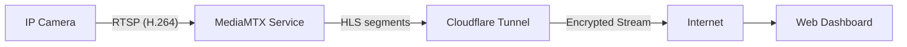

# Live Feed System Architecture

## Overview

The live feed system allows real-time monitoring of store cameras via the web dashboard. It uses a **direct-tunnel architecture** that bypasses the database and backend for video delivery, ensuring low latency and zero storage costs.

## Architecture

The system consists of three main components:

1.  **MediaMTX (RTSP Server)**: A lightweight media server running on the Jetson.
    *   Connects to the IP Camera via RTSP.
    *   Remuxes the stream into HLS (HTTP Live Streaming) format on the fly.
    *   Buffers segments in RAM (no disk I/O).
2.  **Cloudflare Tunnel**: Securely exposes the local MediaMTX HLS stream to the internet.
3.  **Web Dashboard**: Plays the HLS stream directly using `hls.js`.

## Configuration

The configuration lives in `~/mediamtx.yml` on the Jetson device.

### Critical Settings for Stability
*   **Variant**: `fmp4` (Fragmented MP4) - More efficient than legacy MPEG-TS.
*   **Segment Duration**: `6s` - Ensures at least one Keyframe (I-Frame) exists in every segment.
*   **Segment Count**: `6` - Maintains a ~36s rolling window to smooth over network jitter.

## Resource Usage Analysis

### A) Jetson Orin Nano (Edge Device)

*   **CPU Usage**: **Extremely Low (< 5%)**.
    *   Unlike the legacy method, we do **not** transcode video. The H.264 stream from the camera is "remuxed" (container change only) into HLS. This is a copy operation, not a compute operation.
*   **Memory**: **Low (~50MB)**.
    *   Video segments are held in a RAM ring buffer. Old segments are discarded automatically.
*   **Disk I/O**: **Zero**.
    *   No video files are written to the SD card/SSD.
*   **Network Bandwidth**: **Variable**.
    *   The Jetson uploads video data for *each* active viewer.
    *   Formula: `Camera Bitrate * Number of Viewers`.
    *   *Example*: A 2Mbps camera stream with 5 concurrent viewers requires 10Mbps upload speed from the store.

### B) Supabase (Database & Storage)

*   **Storage Costs**: **$0.00**.
    *   Video data **never** touches Supabase.
    *   We only store the text URL (e.g., `https://...trycloudflare.com/...`) in the `cameras` table.
*   **Database CPU**: **Zero**.
    *   Streaming does not trigger any database queries, writes, or edge functions.

### C) Vercel (Frontend Hosting)

*   **Bandwidth**: **Zero**.
    *   The video traffic flows directly from Cloudflare Tunnel to the user's browser.
    *   Vercel serves the React application files once, but the heavy video data completely bypasses Vercel's infrastructure.

## Comparison with Legacy Method

| Feature | Legacy (Python + Supabase) | New (MediaMTX + Tunnel) |
| :--- | :--- | :--- |
| **Latency** | High (15-30s) | Medium (10-15s) |
| **Jetson CPU** | High (FFmpeg Transcoding) | **Negligible** |
| **Storage Cost** | High (Continuous Writes) | **Zero** |
| **Reliability** | Low (File sync issues) | **High** |
| **Setup** | Complex (Custom Python script) | Simple (Binary + Config) |
